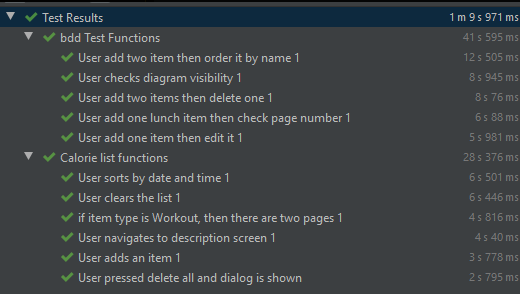

# BDD tesztek készítése

A BDD tesztek elkészítéséhez a Cucumber keretrendszert használtuk. Segítségével a teszteknek egy sokkal olvashatóbb szöveges formáját ismertük meg, ezt mutatja tesztkimenet is.

A tesztek elkészítésekor úgy éreztem, hogy jobban rá vagyok kényszerítve rendes felparaméterezett függvények készítésére, hiszen ha nem olyat csinálok az valószínüleg csak egyszer lesz felhasználható. Nagyon hasznosnak találtam a Scenario Outline használatát, mellyel egy táblázatot rajzolhatunk, aminek az egyes sorai lesznek a teszt bemenetei, amikkel mind lefut majd a tesztünk. 

Az androidos Cucumberrel azt tapasztaltuk, hogy nem volt rendes guide a setuphoz, ami nagyon megnehezítette a feladat elkezdését. Ha valamilyen apró hibát vétünk, annak nehéz felderíteni a forrását. Valamint a Kotlinos integráció sem teljes még, jelenleg folyamatban van.

