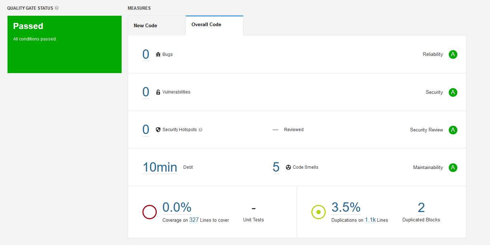
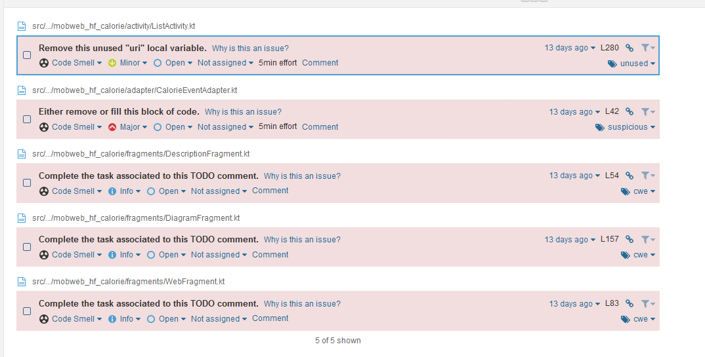

## Statikus kód ellenőrzése

A kód statikus ellenőrzéséhez a SonarQube eszközt használtuk. Az ellenőrzés során az összes osztályt átvizsgáltuk és mivel a projekt mérete és komlexitása is kicsi, emiatt a talált hibák száma is kevés volt. A kódot az analízis eszköz javaslata alapján módosítottuk.

Ezeket az elemeket javítottuk:
- Üres else ágak törlése
- Nem használt lokális változók törlése
- TODO kommentek törlése, amik korábban nem lettek törölve.

A SonarQube által készített statisztika a projektről:

Az észlelt hibák a projektben:
