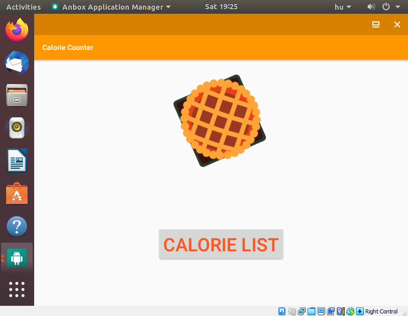

# Deployment segítése Vargant-al

Egy nem HTTP kéréseket váró alkalmazás miatt jó ha a deployment segítőeszköz
nem csak arra nyúj lehetőséget hogy be SSH-zunk, hanem egy komplett Virtuális
gépen ad grafikus felhasználói felületet.

Minden ezzel a feladattal készült config a `vagrantfile`-ban található. Nehézkesen
indultam, mivel eddig még nem dolgoztam _Vagrant_-al. Hogy ne nulláról induljak, egy
olyan _box_-ból indulok ki melyen egy mülödő android emulátor van. Ezután sok sok
trial and error után sikerült kialakitanom egy olyan környezetet ami letölt mindent
ami egy APK összerakásához és telepítéséhez. Ha kész a környezet, a telepítés folyamatát
is automatizálni lehet, hogy minden indulásnál a lehető legkevesebbet kelljen kézzel klikkelni.

Tanulságos volt látni hogyan kell az android studio gui-ja nélkül előállítani az
alkalmazást és erre kialakítani a környezetet.

